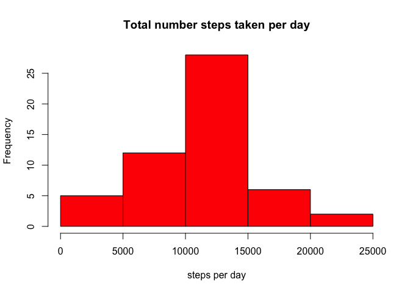
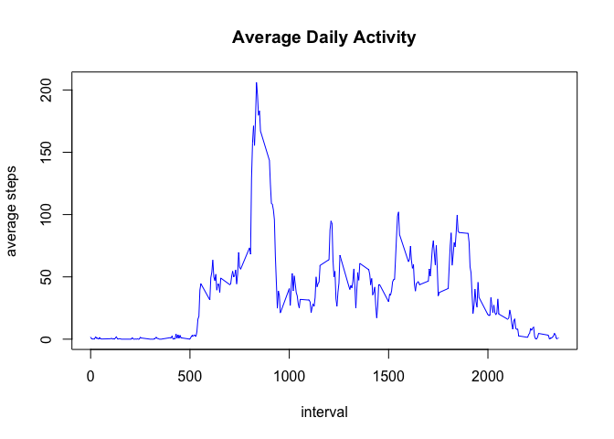
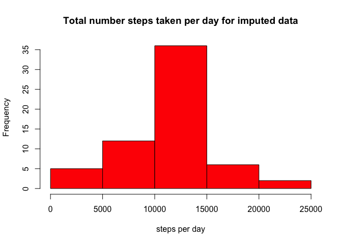
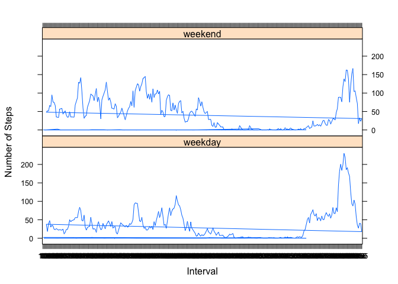

# Reproducible Research: Peer Assessment 1


### NOTE: Figures are in "PA1_template_files/figure-html/"

## Loading and preprocessing the data

```r
activity <- read.csv("activity.csv")
```

## What is mean total number of steps taken per day?


```r
steps_per_day <- tapply(activity$steps[!is.na(activity$steps)],activity$date[!is.na(activity$steps)],FUN=sum)
hist(steps_per_day,col="red",
     main="Total number steps taken per day",
     xlab="steps per day")
```



```r
mean_steps <- mean(steps_per_day[!is.na(steps_per_day)])
median_steps <- median(steps_per_day[!is.na(steps_per_day)])
```

The mean and median of total number of steps taken per day are 
10766 and 10765 respectively.

## What is the average daily activity pattern?


```r
intervals<- as.factor(activity$interval[!is.na(activity$steps)])
steps_per_interval <- tapply(activity$steps[!is.na(activity$steps)],
                             intervals,mean)
plot(levels(intervals),steps_per_interval,type="l",col="blue",
     xlab="interval", ylab="average steps",main="Average Daily Activity")
```



```r
max_activiy_interval <- names(which.max(steps_per_interval))
```

The interval 835 on average contains the maximum number of steps.

## Imputing missing values

```r
num_missing <- sum(is.na(activity$steps))
```

There are 2304 missing values for steps in the activity data.

We impute the missing values with the average number of steps for the corresponding interval and create a new data set names `complete_activity`.


```r
# New data set
complete_activity <- activity
complete_activity$steps[is.na(activity$steps)]  <- sapply(activity$interval[is.na(activity$steps)], 
                                                        function(x,steps_per_interval)
                                                        steps_per_interval[toString(x)],
                                                        steps_per_interval)
```


```r
# Average number of steps per day
new_steps_per_day <- tapply(complete_activity$steps,complete_activity$date,FUN=sum)
hist(new_steps_per_day,col="red",
     main="Total number steps taken per day for imputed data",
     xlab="steps per day")
```



```r
new_mean_steps <- mean(new_steps_per_day)
new_median_steps <- median(new_steps_per_day)
```

The mean and median of total number of steps taken per day are 
10766 and 10766 respectively. These values differ from 
previously computed values from original data. Imputing missing values has improved the estimates for 
total number of steps per day, as now mean and median coincide. 


## Are there differences in activity patterns between weekdays and weekends?

```r
complete_activity$day <- weekdays(as.POSIXlt(complete_activity$date))
complete_activity$day <- sapply(complete_activity$day,function(x) 
                                                        if (x=="Saturday" | x== "Sunday"){
                                                                return("weekend")
                                                        }
                                                        else {
                                                                return("weekday")
                                                        }
        
)
```

```r
intervals<- complete_activity$interval
num_int <- length(unique(intervals))

pdat <- data.frame(rep(unique(intervals),2))
names(pdat) <- "interval"
 
pdat$day <- rep("weekend",2*num_int)

pdat$steps <- rep(0,2*num_int)

pdat$steps[1:num_int] <-tapply(complete_activity$steps[complete_activity$day=="weekend"],
                               intervals[complete_activity$day=="weekend"],
                               mean)

pdat$day[(num_int+1):(2*num_int)] <- "weekday"
#pdat$day <- as.factor(pdat$day)
pdat$steps[(num_int+1):(2*num_int)] <-
        tapply(complete_activity$steps[complete_activity$day=="weekday"],
                        intervals[complete_activity$day=="weekday"],
                        mean)

library(lattice)
xyplot(steps~interval | day, data = pdat,
     type = 'l',
      xlab = 'Interval',
      ylab = 'Number of Steps',
      layout = c(1,2))
```



On Weekdays the person is equally active through the daytime, whereas on weekends there is high level of activity(maybe he/she excercises) in late morning and then it decreases sharply (maybe watching movies).
